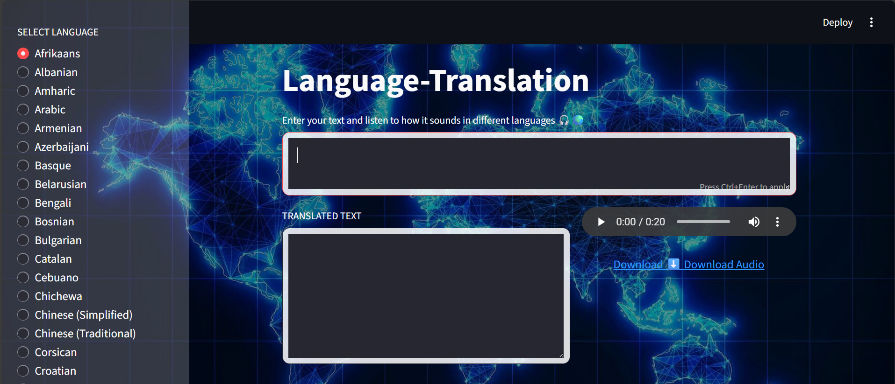

---

## 🖼️ UI Preview



---
````markdown
# 🌍 Global Voice Translator

An interactive **Language Translation & Voice Application** built with **Python** and **Streamlit**,
enabling users to translate text into 60+ languages and listen to the translated speech instantly.

---

## 🚀 Features

- 🌐 Translate text into 60+ global languages  
- 🔊 Listen to natural-sounding translations via **gTTS**  
- 💾 Download audio output as an MP3  
- 🎨 Modern UI with a glowing **world map background**  
- 🧭 Sidebar-based language selection  
- 🧱 Two-column layout separating text and voice output  

---

## 🛠️ Tech Stack

**Frontend / UI:** Streamlit + Custom CSS  
**Libraries Used:**
- `mtranslate` – translation engine  
- `gTTS` – Google Text-to-Speech  
- `pandas` – manage language data  
- `base64` – audio encoding and download  
- `HTML/CSS` – UI customization  

---

## ⚙️ Installation

```bash
pip install streamlit mtranslate gTTS pandas
````

---

## ▶️ Run the App

```bash
streamlit run app.py
```

---

## 📂 File Structure

```
Global-Voice-Translator/
│
├── app.py
├── language.csv
└── README.md
└── code_explanation.md
└── img.png
```

---

## 🧠 Learning Outcomes

* Created multilingual text translation and TTS integration
* Applied **Streamlit** for real-time interactive UIs
* Implemented **audio encoding and dynamic download feature**

